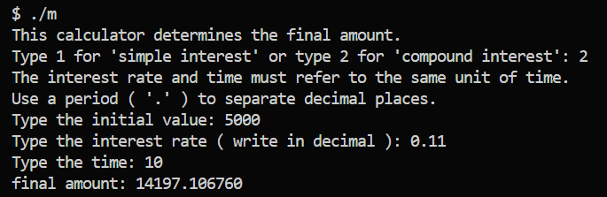

# INTEREST CALCULATOR

## Simple Interest:
Simple interest is calculated only on the initial principal amount throughout the entire time period. In other words, the interest amount remains constant for each time period and is calculated on the initial principal amount. The formula to calculate simple interest is:

``` J = P × r × t  ```

Where:

- J is the total interest amount

- P is the principal (initial amount)

- r is the interest rate per period

- t is the number of periods

## Compound Interest:
Compound interest is calculated on both the principal amount and also on the accumulated interest in each period. This means that the interest amount in each period is added to the principal to calculate the interest for the next period. The formula to calculate compound interest is:

``` A = P × ( 1 + r )^t ``` 

Where:

- A is the total amount accumulated after 

- P is the initial value

- r is the interest rate per period

- t is the number of your time unit

### Importance of Calculator:
A calculator for simple and compound interest is important because it facilitates precise calculation of interest in different financial scenarios. These tools are useful for better understanding how interest affects the growth of investments, loans, financing, and other financial transactions. An efficient calculator can save time and prevent calculation errors, enabling more informed decision-making in financial matters.

## Example in VScode terminal:

